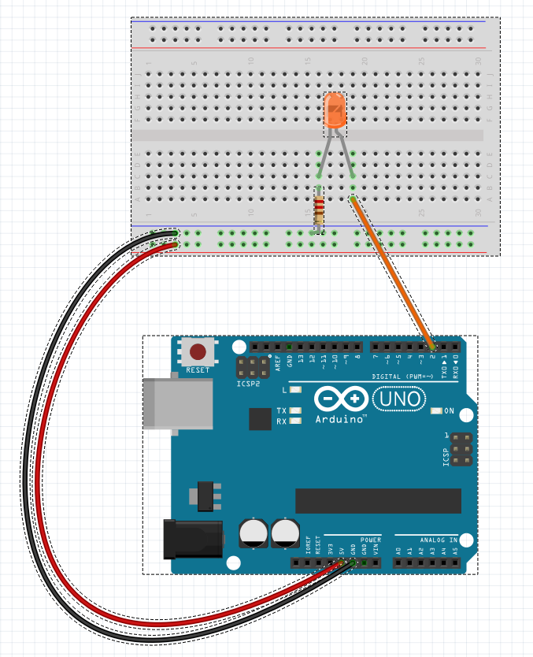
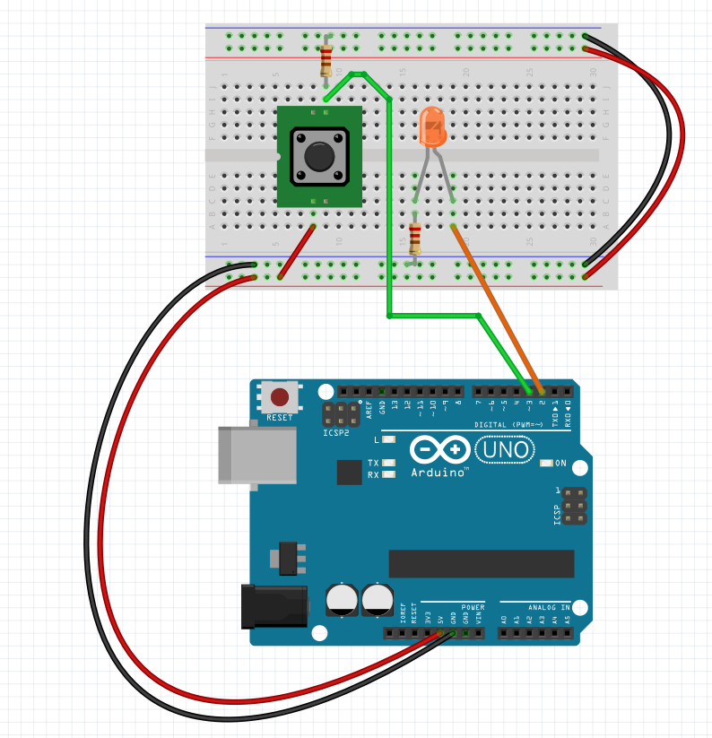
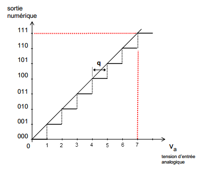
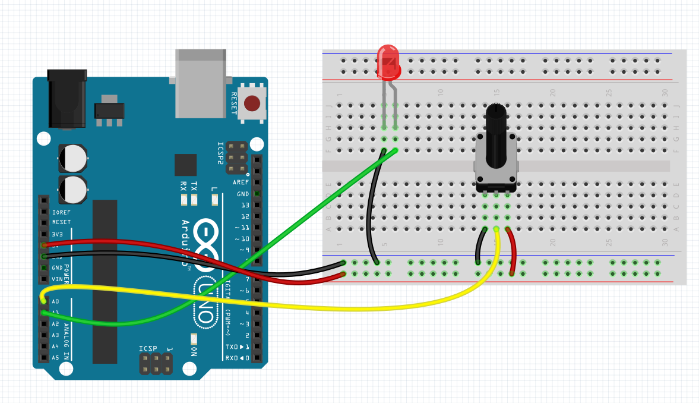
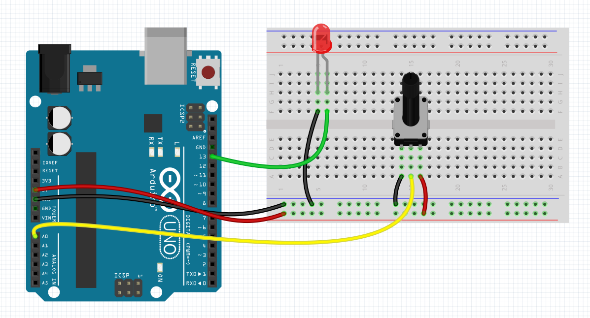
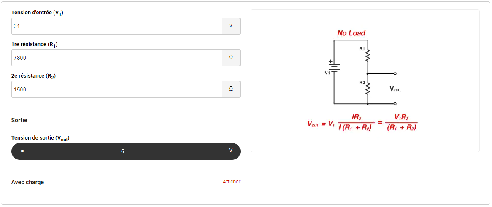
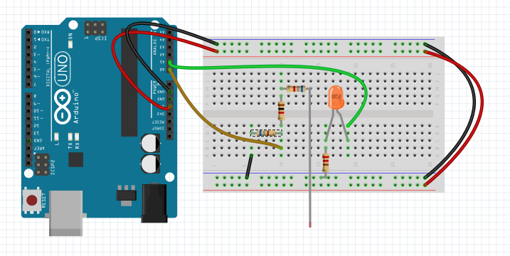
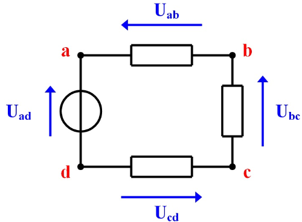
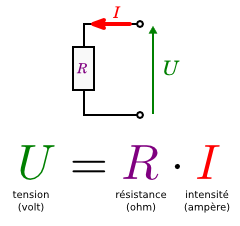
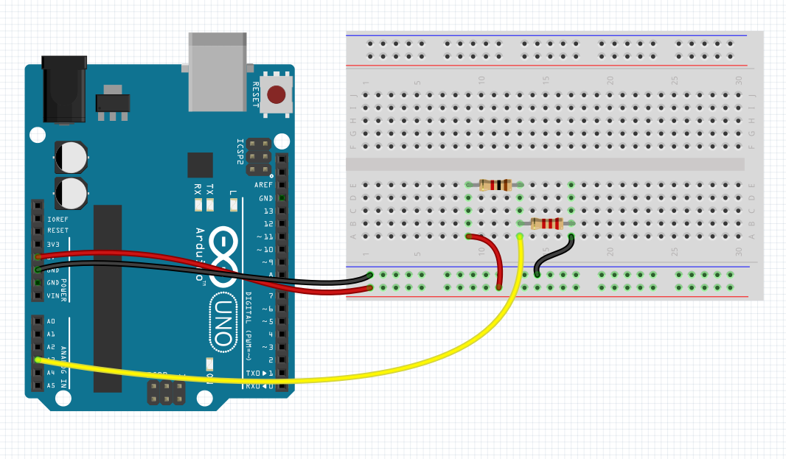

# arduino-tp
cahier de tp pour le cours arduino

## Composants necessaires

- arduino uno
- 1x led
- 1x push button
- 1x résistance 22k&ohm;
- 2x résistances 1k&ohm;
- 1x résistance 6.8k&ohm;
- 1x résistance 680&ohm;
- 1x potentiomètre linéaire
- 1x thermistance *(103)* 1k&ohm;

# Arduino_tp_list

# Projet 0

Découverte du code arduino minimum

## 0.1. Composants

- Aucun

## 0.2. code

~~~c
    void setup(){
        //code exécuter au départ de l'exécution du code
    }
    void loop(){
        //boucle d'exécution infinie 
    }
~~~

### 0.2.1. ***void setup ()***

>**fonction obligatoire** pour l'appel de tous les   >constructeurs d'instances diverses.
>
>cette fonction est exécutée une seul fois au démarrage de la puce

### 0.2.2 ***void loop()***

>**fonction obligatoire** exécuter en boucle lorsque la puce est allumée. Cette fonction commence à être exécutée qu’une fois le setup achevé

----------

# projet 1 : clignotement d'une LED

Découverte des sorties *Tout Ou Rien*.

## 1. Enoncé

Clignotement continue d'une diode électroluminescente

## 1.1. composants

- arduino uno
- 1x LED
- une résistance *(*facultatif)*

## 1.2. Code

fichier source : *projets/tp1/tp1.ino*

~~~c

    void setup() {
        //définition du mode de l'I/O
        pinMode(2, OUTPUT);
    }

    void loop() {
        //écriture sur le port
        digitalWrite(2, HIGH);
        delay(750);
        digitalWrite(2, LOW);
        delay(750);
    }
~~~

### 1.2.1 ***pinMode(*IOPin*, *digitalValue*)***

Def. du type d'usage d'un port numérique. Cette fonction permet de fixer des résistances à VCC ou GND

- #### *IOPin*

  - Valeur ou nom de l'entrée
    >
    >- 1, 2, ..., 13 : pour les ports digitaux
    >- A0, A1, ..., A5 : pour les ports digitaux. attention certaines cartes possèdent 2 ports CAN en plus (A6 / A7)

- #### *digitalValue*

  - Def. des PULLUP / PULLDOWN res sur les entrées / sorties :
    >
    >- OUTPUT : PULLUP résistance interne sur VCC
    >- INPUT  : PULLDOWN résistance interne sur GND

### 1.2.2. **digitalWrite(*IOPin*, *digitalValue*)**

Ecriture état numérique HAUT ou BAS *simple et constant ou remplissage cyclique PWM* sur une sortie digitale (TOR)

- *IOPin* : [cf. : valeur ou nom de l'entrée](#iopin)
  
- *digitalValue*
  - Valeur à écrire sur le port : {#digital-value}
    >
    >- HIGH / LOW : état fixe et constant
    >- 0, 25, ..., 254, 255 : état de remplissage de cycle PWM, remplissage continu (sur les ports compatibles uniquement indiqués par '~' )

## 1.3. Montage

fichier fritzing : projets/tp1/projet1.fzz

----------

# Projet 2

Lecture numérique TOR sans gestion d'interruption, et écriture en fonction de l'état de l'entrée

# 2. Enoncé

Lire l'état d'un bouton et allumer une diode en fonction du bouton

## 2.1. Composants

- arduino uno
- 1x push button
- 1x led
- 2x résistances

## 2.2. Code

fichier source : *projets/tp2/tp2.ino*

~~~c
    void setup() {
        //définition du mode de l'I/O
        pinMode(2, OUTPUT);
        pinMode(3, INPUT);
    }

    void loop() {
        //lecture de l'état de l'entrée
        bool isD3Pushed=digitalRead(3);
        if(isD3Pushed){
            digitalWrite(2, HIGH);
        }
        else {
            digitalWrite(2, LOW);
        }
    }
~~~

### 2.2.1. **digitalRead(*IOPin*)**

Lecture d'état numérique HAUT ou BAS simple sur une entrée numérique (TOR)

- *IOPin* : [cf. : valeur ou nom de l'entrée](#iopin)

## 2.3. Montage

fichier fritzing : *projets/tp2/projet.fzz*

----------

# Projet 3

Découverte de la liaison série *HardwareSerial*.

Ecriture vers le port série matériel

## 3. Enoncé

- récupérer et stocker l'état d'allumage
- stocker & modifier l'état d'allumage uniquement lors d’un nouveau click sur le bouton
- afficher l'état d'allumage en cas de changement

## 3.1. composants

- arduino uno
- 1x push button
- 1x led
- 2x résistances

## 3.2. code

fichier source : *projets/tp3/tp3.ino*

~~~c
    bool ledState = false;
    void setup()
    {
        // définition du mode de l'I/O
        pinMode(2, OUTPUT);
        pinMode(3, INPUT);
        digitalWrite(2, ledState);

        // def. de la vitesse du port série
        Serial.begin(9600);

        //Ecriture sans retour chariot
        Serial.print("Projet 3");
        
        //Ecriture avec retour chariot
        Serial.println(" écriture série");
    }

    void loop()
    {
        // lecture de l'état de l'entrée
        bool isD3Pushed = digitalRead(3);
        if (isD3Pushed)
        {
            //Ecriture avec retour chariot 
            Serial.println("button enfoncé");
            
            ledState=!ledState;

            //écriture du nouvel état d'allumage
            Serial.print("Etat d'allumage : ");
            Serial.println(ledState);

            //attente du relâchement du button avant nouveau cycle de loop
            delay(800);
        }
         digitalWrite(2, ledState);
    }
~~~

### 3.2.1 **Serial.begin(*serialSpeed*)**

Instanciation de l'objet ***Serial*** et ouverture du port série et def. de la vitesse de transmission.

- *serialSpeed*
  
  Vitesse en bits/sec (bauds)
  
  >- 300, 1200, 2400, 4800, **9600**, 19200, 38400, **57600**, **115200** : valeurs admises. les valeurs en gras (**9600, 57600, 115200**) sont des valeurs standard fortement utilisées

### 3.2.2 **Serial.print(*printableValue*) / Serial.println(*printableValue*)**

Ecriture de contenu vers la sortie série. **Serial.println** ajoute un saut de ligne en fin d'impression de contenu vers la sortie

- *printableValue*
    Contenu imprimable à diffuser de n'importe quel type de données
    >
    >- "const char" : chaine de caractère constante
    >- 123 ou 123.45 : entier ou float
    >- *varName* : variable de tous types. les chaines de **char** doivent finir par le caractère **'\0'**

### 3.3. montage

fichier fritzing : *projets/tp3/projet3.fzz*

### 3.4. doc officiel

- **HarwareSerial**
  [https://www.arduino.cc/reference/en/language/functions/communication/serial/](https://www.arduino.cc/reference/en/language/functions/communication/serial/)
  
  - *Serial.begin*
  [https://www.arduino.cc/reference/en/language/functions/communication/serial/begin/](https://www.arduino.cc/reference/en/language/functions/communication/serial/begin/)
  
  - *Serial.println*
  [https://www.arduino.cc/reference/en/language/functions/communication/serial/println/](https://www.arduino.cc/reference/en/language/functions/communication/serial/println/)
  
  - *Serial.print*
  [https://www.arduino.cc/reference/en/language/functions/communication/serial/print/](https://www.arduino.cc/reference/en/language/functions/communication/serial/print/)

----------

# Projet 4

Découverte de la liaison série *HardwareSerial*.

Lecture depuis le port série matériel

## 4. Enoncé

- base : [projet 3](#projet-3)
- modifier l'état d'allumage lors d'une saisie '1' ou 'on' sur le port série
  - la saisie sera effectuer sans string uniquement par tableau **char [ ]**
- afficher l'état d'allumage en cas de changement

## 4.1. composants

- arduino uno
- 1x led
- 1x résistances

## 4.2. code

fichier source : *projets/tp4/tp4.ino*

~~~c
bool ledState = false;
void flushSerialInput();
void setup()
{
  // définition du mode de l'I/O
  pinMode(2, OUTPUT);
  pinMode(3, INPUT);
  digitalWrite(2, ledState);

  // def. de la vitesse du port série
  Serial.begin(9600);

  // Ecriture sans retour chariot
  Serial.println("Projet 4 \nLecture/Ecriture série");
}

void loop()
{
  if (Serial.available())
  {
    // attente du remplissage du buffer avant lecture
    delay(100);
    char str[5] = "";
    int i=0;
    //strlen(str)< (taille Max - caractère d'arrêt de chaine)
    while (Serial.available() && strlen(str) < 4)
    {
      char aChar ='\0';
      aChar=Serial.read();
      //si le caractère reçu est imprimable
      if(isPrintable(aChar)){
        str[i++]=aChar;
      }
    }
    //vidange du buffer de lecture
    flushSerialInput();
    str[i]='\0';
    //si la chaine est "on" ou "1"
    if(strcmp(str,'on') || strcmp(str,"1")){
      ledState=true;
    }
    //sinon si la chaine est "off" ou "0"
    else if (strcmp(str,"off")|| strcmp(str,"0"))
    {
        ledState=false;
    }
  }
  digitalWrite(2, ledState);
}
void flushSerialInput(){
  while(Serial.available()){Serial.read();}
}
~~~

### 4.2.1. **Serial.available()**

Fonction qui *retourne le nombre d'octet(s) (caractère(s)) disponible* dans le buffer de réception de la liaison série. A chaque exécution de lecture sur le buffer le nb disponible descend

- **retour** : entier du nb d'octet disponible à la lecture
  
### 4.2.2. **Serial.read()**

Fonction de lecture octet par octet du buffer d'entrée de Serial. un équivalent existe pour lire un string complet jusqu'à un retour chariot ***serial.readString()***

- **retour** : premier octet disponible à la lecture ou -1 si aucune valeur existe

### 4.2.3. **isPrintable(aChar)**

fonction de vérification de l'existence d'un symbole affichable pour la valeur d'un caractère

- **retour** : vrai si le caractère est imprimable et faux si c'est un caractère de contrôle non affichable

- *aChar* : un caractère unique à tester

### 4.3. montage

fichier fritzing : *projets/tp4/projet4.fzz*

### 4.4. Doc officiels

- **HarwareSerial**
  [https://www.arduino.cc/reference/en/language/functions/communication/serial/](https://www.arduino.cc/reference/en/language/functions/communication/serial/)
  - *Serial.available*
    [https://www.arduino.cc/reference/en/language/functions/communication/serial/available/](https://www.arduino.cc/reference/en/language/functions/communication/serial/available/)
  - *Serial.read*
    [https://www.arduino.cc/reference/en/language/functions/communication/serial/read/](https://www.arduino.cc/reference/en/language/functions/communication/serial/read/)
  - *Serial.readString*
    [https://www.arduino.cc/reference/en/language/functions/communication/serial/readstring/](https://www.arduino.cc/reference/en/language/functions/communication/serial/readstring/)
  
----------
# Projet 4b

Découverte de la liaison série *HardwareSerial*.

Lecture depuis le port série matériel

## 4b. énoncé

- base : [projet 4](#projet-4)
- gérer la lecture par gestion d'évènement

## 4b.1. composants

- arduino uno
- 1x led
- 1x résistance

## 4b.2. code

fichier source : *projets/tp4b/tp4b.ino*

~~~c
bool ledState = false;
void flushSerialInput();
void setup()
{
  // définition du mode de l'I/O
  pinMode(2, OUTPUT);
  pinMode(3, INPUT);
  digitalWrite(2, ledState);

  // def. de la vitesse du port série
  Serial.begin(9600);

  // Ecriture sans retour chariot
  Serial.println("Projet 4 \n Ecriture série avec SerialEvent");
}

void loop()
{
  digitalWrite(2, ledState);
}
void flushSerialInput(){
  while(Serial.available()){Serial.read();}
}
void SerialEvent(){
    
    // attente du remplissage du buffer avant lecture
    delay(100);
    char str[5] = "";
    int i=0;
    //strlen(str)< (taille Max - caractère d'arrêt de chaine)
    while (Serial.available() && strlen(str) < 4)
    {
      char aChar ='\0';
      aChar=Serial.read();
      //si le caractère reçu est imprimable
      if(isPrintable(aChar)){
        str[i++]=aChar;
      }
    }
    //vidange du buffer de lecture
    flushSerialInput();
    str[i]='\0';
    //si la chaine est "on" ou "1"
    if(strcmp(str,'on') || strcmp(str,"1")){
      ledState=true;
    }
    //sinon si la chaine est "off" ou "0"
    else if (strcmp(str,"off")|| strcmp(str,"0"))
    {
        ledState=false;
    }
}
~~~

### 4b.2.1. **void SerialEvent(){...}**

Fonction évènementielle déclenchée automatiquement lorsqu'un byte deviens disponible

### 4b.3. montage

fichier fritzing : *projets/tp4b/projet4b.fzz*

### 4b.4. doc officiels

- **HarwareSerial**
  [https://www.arduino.cc/reference/en/language/functions/communication/serial/](https://www.arduino.cc/reference/en/language/functions/communication/serial/)

  - *SerialEvent*
    [https://www.arduino.cc/reference/en/language/functions/communication/serial/serialevent/](https://www.arduino.cc/reference/en/language/functions/communication/serial/serialevent/)
  
----------
# Projet 5

Découverte du convertisseur Analogique / numérique (CAN/DAC) 10bits

## 5. Enoncé

- prendre la mesure en volt de la sortie d'un potentiomètre linéaire
- écrire dans la console la tension

## 5.1. composants

- arduino uno
- 1x potentiomètre linéaire

## 5.2. code

fichier source : *projets/tp5/tp5.ino*

~~~c
void setup()
{
  // def. de la vitesse du port série
  Serial.begin(9600);

  // Ecriture sans retour chariot
  Serial.println("Projet 5");
}

void loop()
{
  uint8_t potValue = analogRead(A1);
  analogWrite(A0, potValue);
  
  float voltValue= ( 5 / 1024 ) * potValue;
  Serial.print("Valeur de tension : ");
  Serial.print(voltValue);
  Serial.print("V");
}
~~~

### 5.2.1. ***analogRead(*IOPin*)***

- **retour** : entier entre 0 et 1023 correspondant à la conversion de la tension d'entrée en fonction de la tension de réf de la carte (+5v) soit 5/1024 = 0.0048828125v par palier

- *IOPin* : [cf. : valeur ou nom de l'entrée](#iopin)
  
### 5.2.1. ***analogWrite(*IOPin*, *analogValue*)***

- *IOPin* : [cf. : valeur ou nom de l'entrée](#iopin)
- *analogValue* : valeur entière de 0 à 1023 représentant une fraction de la tension max

## 5.3 montage

analogique

fichier fritzing : *projets/tp5/projet5.fzz*

avec régulation de sortie pwm

fichier fritzing : *projets/tp5/projet5.fzz*

## 5.4. doc officiels

- I/O analogique
  - *analogRead*
    [https://www.arduino.cc/reference/en/language/functions/analog-io/analogread/](https://www.arduino.cc/reference/en/language/functions/analog-io/analogread/)
  - *analogWrite*
    [https://www.arduino.cc/reference/en/language/functions/analog-io/analogwrite/](https://www.arduino.cc/reference/en/language/functions/analog-io/analogwrite/)

----------
# Projet 5a

## 5a. Enoncé

transformation du projet en lecteur de tension (voltmètre) pour une tension maximal de 31v et une intensité d'entrée dépassant pas 200mA **en utilisant des valeur normalisées de résistance**.

utilisation de la loi de Kirchhoff, le pont diviseur de tension.

calculateur en ligne :
[https://www.digikey.fr/fr/resources/conversion-calculators/conversion-calculator-voltage-divider](https://www.digikey.fr/fr/resources/conversion-calculators/conversion-calculator-voltage-divider)

pour limiter 31v a une sortie 5v voici les valeurs :

- R1 : **6.8K&ohm; + 1k&ohm;**
  
  >l'intensité (I=U/R) max traversant cette résistance est de :
  >
  >31 / 7800 = 0.00397A
  >
  >soit 3mA

- R2 : **1.5K&ohm;**

## 5a.1. composants

- arduino uno
- 1x LED
- 1x résistance 6.8k&ohm;
- 1x résistance 1k&ohm;
- 1x résistance 680&ohm;

## 5a.2. code

fichier source : *projets/tp5a/tp5a.ino*

~~~c
void setup()
{
  // def. de la vitesse du port série
  Serial.begin(9600);

  // Ecriture sans retour chariot
  Serial.println("Projet 5");
}

void loop()
{
  uint8_t potValue = analogRead(A1);
  analogWrite(A0, potValue);
  
  //ratio pour 31v
  float ratio = 31/5;

  //calcul de tension
  float voltValue= (( 5 / 1024 ) * potValue)*ratio;

  Serial.print("Valeur de tension : ");
  Serial.print(voltValue);
  Serial.print("V");
}
~~~

## 5a.3. montage

fichier fritzing : *projets/tp5a/projet5a.fzz*

----------

# projet 5b

sur le modèle du pont de Kirchhoff, il est possible d'acquérir des valeurs depuis n’importe quel sensor résistif linéaire. Ex : LDR (photorésistance), NTC (Thermistance), sensor de flexion, ...

Grâce aux lois régissant l'électronique :

- loi des mailles
  - la somme des tensions dans une maille est égale à 0v
  
  

- loi des mailles
  - La somme des intensité entrante en un point est égale a la somme des intensités sortante du même points
  
  

- la loi d'ohm avec la formule U = R * I 
  et ses déclinaisons I=U/R &amp; R = U/I

  

il est facile déduire la valeur d'une résistance dans un pont diviseur de tension grâce à la tension récupérer

## 5b. Enoncé

- récupérer une valeur de tension au borne d'une résistance.
- afficher la valeur de la résistance en &ohm;

## 5b.1. Composants

- arduino uno
- 1x résistance 22k&ohm;
- 1 résistance &lambda;&ohm; à tester;

## 5b.2. Code

fichier source : *projets/tp5b/tp5b.ino*

~~~c
#define CANPIN A3
float R1 = 2200.0F;
float VIN = 5.0F;
void setup()
{
    Serial.begin(9600);
}
void loop()
{
    // récupérer la tensions aux bornes de R2
    int canValue = analogRead(CANPIN);
    // tension en A3
    float vOut = canValue * (VIN / 1024);
    // calcul:
    // vOut=(R1/(R1+R2)) * VIN
    // r2=R1 * ( VIN / vOut) -R1
    float r2 = R1 * (VIN / vOut) - R1;
    Serial.print("Res : ");
    Serial.println(r2);
    delay(1000);
}
~~~

## 5b.3. Montage

fichier fritzing : *projets/tp5b/projet5b.fzz*

----------
